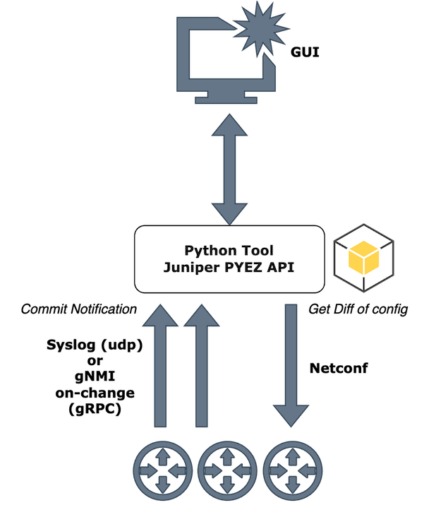

# Automation Demo

A collection of Junos network-automation demos built around
[Juniper PyEZ](https://github.com/Juniper/py-junos-eznc), Ansible and
modern orchestration tooling.

This repository currently ships **two independent demos**:

| Demo | What it shows | Details |
|------|---------------|---------|
| **Commit Watcher** | Turn Junos **commit** events (syslog / gNMI) into a searchable archive of configuration diffs stored in MongoDB, with a small web UI to browse a per-router timeline. | [commit_watcher/README.md](commit_watcher/README.md) |
| **Guided Junos Upgrade** | A **Temporal.io** workflow that orchestrates the bundled Ansible playbooks to run a full guided Junos upgrade (drain → upload → install → reboot → verify → restore), driven entirely from the Temporal Web UI. | [upgrade_temporal_ansible/README.md](upgrade_temporal_ansible/README.md) |

## Clone the repository

```bash
git clone https://github.com/door7302/automation_demo.git
cd automation_demo
```

## The demos

### 1. Commit Watcher — [`commit_watcher/`](commit_watcher/)

Detects successful commits (via `UI_COMMIT_COMPLETED` syslog messages, a gNMI
on-change subscription, or both), reads the commit diff over NETCONF and stores
one document per commit in MongoDB — ready to be displayed as a per-router
timeline of changes.



➡️ Full setup and usage: [commit_watcher/README.md](commit_watcher/README.md)

### 2. Guided Junos Upgrade — [`upgrade_temporal_ansible/`](upgrade_temporal_ansible/)

Reproduces a **Junos Guided Upgrade** as a Temporal workflow. Each step runs one
of the bundled Ansible playbooks, and the inventory plus credentials are passed
as JSON input from the Temporal Web UI — no files to edit on the worker.


➡️ Full setup and usage: [upgrade_temporal_ansible/README.md](upgrade_temporal_ansible/README.md)

