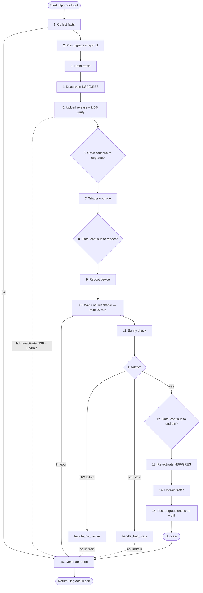

# Upgrade workflow with temporal 

## Install 

From the **repository root**:

```bash
cd $PWD/juniper_api 
source .venv/bin/activate        

# Install the watcher's own dependencies
python3 -m pip install -r tools/upgrade_auto/requirements.txt
```

## Running the upgrade workflow (Temporal)

The device upgrade orchestration in [device_upgrade_workflow.py](device_upgrade_workflow.py)
runs on [Temporal](https://temporal.io/). Temporal has two parts:

- **The Temporal server** — runs in Docker (PostgreSQL + Temporal + Web UI). It
  only stores workflow state, queues and history; it does **not** run your code.
- **The Worker** — a local Python process that actually executes the workflow and
  activities, and imports `juniper_api`. It connects to the server on
  `localhost:7233`, so it must run in the environment where `juniper_api` (and
  `temporalio`) are installed.

### Configuration you must adapt

Before starting the stack, review these settings:

- **`server_name` in [nginx.conf](temporal-stack/nginx/nginx.conf)** (HTTPS mode only) —
  it currently contains a placeholder hostname (`rtme-ubuntu-03.englab.juniper.net`).
  Replace **both** occurrences with your own server's hostname (or `localhost` for
  local testing) so it matches the address users will type in the browser and the
  Common Name (CN)/SAN of your TLS certificate:

  ```nginx
  server {
      listen 8081 ssl;
      server_name your-server.example.com;   # <-- change this
      ...
  }
  ```

- **TLS certificates** (HTTPS mode only) — place `server.crt` (fullchain) and
  `server.key` in [temporal-stack/certs](temporal-stack/certs), or generate a
  self-signed pair once with `bash certs/generate-certs.sh`.

- **Entry port** — the browser-facing port is always `8081` for both HTTP and
  HTTPS. If `8081` is already used on your host, change the published port in
  [docker-compose.http.yml](temporal-stack/docker-compose.http.yml) /
  [docker-compose.https.yml](temporal-stack/docker-compose.https.yml) and the
  matching `TEMPORAL_CORS_ORIGINS` value.

### Get it running

```bash
# 0. Install everything (juniper_api + temporalio) once
cd $PWD/juniper_api
source .venv/bin/activate

# 1. Start Temporal (Web UI entry port is always 8081: http://localhost:8081 or https://localhost:8081)
# HTTP
docker compose -f tools/upgrade_auto/temporal-stack/docker-compose.yml -f tools/upgrade_auto/temporal-stack/docker-compose.http.yml up -d
# or 
# HTTPS - make sure to put in python3 tools/upgrade_auto/temporal-stack/certs (temporal-ui.crt and temporal-ui.key)
# Generate a local self-signed cert for https://localhost (once)
# bash certs/generate-certs.sh 
docker compose -f tools/upgrade_auto/temporal-stack/docker-compose.yml -f tools/upgrade_auto/temporal-stack/docker-compose.https.yml up -d

# 2. Start the worker in the background
nohup python3 tools/upgrade_auto/upgrade-wf/device_upgrade_workflow.py worker > worker.log 2>&1 &
```

### Stopping everything

```bash
pkill -f device_upgrade_workflow.py           # stop the worker

# stop the Temporal stack — use the SAME override you started with
cd $PWD/juniper_api
docker compose -f tools/upgrade_auto/temporal-stack/docker-compose.yml -f tools/upgrade_auto/temporal-stack/docker-compose.http.yml down    # if HTTP
# or if HTTPS
docker compose -f tools/upgrade_auto/temporal-stack/docker-compose.yml -f tools/upgrade_auto/temporal-stack/docker-compose.https.yml down # if HTTPS
```

### Launching an upgrade

The workflow takes a single `UpgradeInput` argument (see
[upgrade_tasks/models.py](upgrade-wf/upgrade_tasks/models.py)). You can start it
from the Temporal Web UI (**Start Workflow → Input**) or with the CLI helper.

#### Input fields

| Field | Required | Default | Description |
| --- | --- | --- | --- |
| `connection.host` | ✅ | — | Device hostname or IP (NETCONF target). |
| `connection.user` | ✅ | — | Login username. |
| `connection.passwd` | ✅* | `null` | Login password. *Optional if `ssh_private_key_file` is used. |
| `connection.port` | | `830` | NETCONF port. |
| `connection.ssh_private_key_file` | | `null` | Path to an SSH private key (alternative to `passwd`). |
| `image_path` | ✅ | — | **Local** path (on the worker host) to the Junos install image. |
| `target_release_md5` | ✅ | — | Expected MD5 of the image; verified on-device after upload. |
| `remote_path` | | `/var/tmp` | Destination directory on the device. |
| `method` | | `scp` | Transfer method: `scp` or `ftp`. |
| `copy_to_backup` | | `true` | Copy the image from the master RE to the backup RE. |
| `drain_payload` | | `["set protocols isis overload"]` | Config commands applied (atomic commit) to drain traffic. |
| `undrain_payload` | | `["delete protocols isis overload"]` | Config commands applied to undrain traffic. |
| `approval_timeout_minutes` | | `30` | How long a human-approval gate waits before timing out. |
| `snapshot_dir` | | `null` | Local directory to save pre/post snapshots into. |
| `scp_socket_timeout` | | `600.0` | Per-channel SCP timeout (seconds) for the upload. |

#### Example (Temporal Web UI — single-argument array)

When using **Start Workflow** in the Temporal Web UI, fill in these fields:

| Field | Value |
| --- | --- |
| **Workflow ID** | any unique id, e.g. `upgrade-rtme-mx304-06.englab.juniper.net` |
| **Task Queue** | `device-upgrade-queue` |
| **Workflow Type** | `DeviceUpgradeWorkflow` |

Then paste the input as a single-argument array:

```json
{
  "connection": {
    "host": "rtme-mx304-06.englab.juniper.net",
    "user": "lab",
    "passwd": "lab123"
  },
  "image_path": "junos-vmhost-install-mx-x86-64-25.2R1.9.tgz",
  "target_release_md5": "7c5b1eb4d87e5e353990d709e5b6c0ce"
}
```

#### Example (CLI helper)

```bash
python3 tools/upgrade_auto/upgrade-wf/device_upgrade_workflow.py start \
  rtme-mx304-06.englab.juniper.net \
  lab \
  lab123 \
  junos-vmhost-install-mx-x86-64-25.2R1.9.tgz \
  7c5b1eb4d87e5e353990d709e5b6c0ce
```

> `image_path` is resolved on the **worker** host. If the image is not in the
> worker's working directory, give a full/relative path (e.g.
> `pkg/junos-vmhost-install-mx-x86-64-25.2R1.9.tgz`).

### Workflow diagram

The orchestration in [device_upgrade_workflow.py](upgrade-wf/device_upgrade_workflow.py)
runs the following steps. Diamond nodes are human-in-the-loop **continue gates**
(operator sends the empty `operator_continue` signal); dashed arrows are
compensation / failure paths. A report is always generated at the end.



