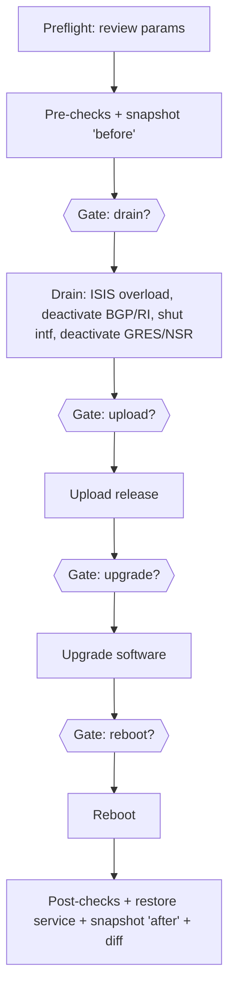

# Guided Upgrade without AWX — Option A (CLI umbrella playbook)

This document explains [playbooks/guided_upgrade.yml](playbooks/guided_upgrade.yml),
a single `ansible-playbook` run that reproduces the **Junos Guided Upgrade**
workflow **without AWX / Automation Controller**.

It is the "Option A (light)" approach: an *umbrella* playbook that chains the
existing per-task playbooks and adds interactive approval gates. It is meant to
run from the controller / execution host exactly like the individual playbooks.

---

## 1. What it does

The umbrella runs the same phases, in the same order, as the AWX workflow:



Each **Gate** is an `ansible.builtin.pause`:

- **ENTER** → proceed to the next phase.
- **Ctrl-C then A** → abort the entire run.

The linear phases are pulled in with `import_playbook`, which is a *static*
include evaluated when Ansible parses the file — that is why the whole plan is
laid out top-to-bottom in one file.

---

## 2. How to run it

Install collections once, then launch:

```bash
ansible-galaxy collection install -r requirements.yml

ansible-playbook playbooks/guided_upgrade.yml \
  -e target_hosts=rtme-mx-25 \
  -e user=regress -e password=secret \
  -e release_file=junos-install-mx-x86-64-23.4R1.9.tgz \
  -e local_repo=/var/tmp/images
```

### Required parameters (extra-vars)

| Variable       | Meaning                                              | Example |
|----------------|------------------------------------------------------|---------|
| `target_hosts` | A host or group from `inventory.yml`                 | `rtme-mx-25` or `junos_devices` |
| `user`         | Device login username                                | `regress` |
| `password`     | Device login password                                | `secret` |
| `release_file` | Image filename (already present in `local_repo`)     | `junos-install-mx-x86-64-23.4R1.9.tgz` |
| `local_repo`   | Controller folder holding the image **and** its `.md5` | `/var/tmp/images` |

These are passed as **extra-vars**, which are global to every imported
playbook. `group_vars/junos_devices.yml` maps `user`/`password` onto
`ansible_user`/`ansible_password`, so the same values reach every device play.

> **Why extra-vars and not a `vars_prompt`?** `vars_prompt` values live only
> inside the play that prompted; they do **not** propagate to the other plays /
> hosts in the run. Extra-vars are global, so they are the reliable way to feed
> every phase from one place.

### Keep secrets out of shell history

Put the parameters in a file and reference it with `@`:

```yaml
# upgrade-params.yml
target_hosts: rtme-mx-25
user: regress
password: secret
release_file: junos-install-mx-x86-64-23.4R1.9.tgz
local_repo: /var/tmp/images
```

```bash
ansible-playbook playbooks/guided_upgrade.yml -e @upgrade-params.yml
```

(For real use, encrypt that file with `ansible-vault` and run with
`--ask-vault-pass`.)

---

## 3. Optional phases (skip with tags)

Every `import_playbook` is tagged by phase: `prechecks`, `drain`, `upload`,
`upgrade`, `reboot`, `postchecks`, `restore`. Skip a phase **at launch** with
`--skip-tags`:

```bash
# skip the reboot
ansible-playbook playbooks/guided_upgrade.yml -e @upgrade-params.yml \
  --skip-tags reboot

# install, but don't reboot
ansible-playbook playbooks/guided_upgrade.yml -e @upgrade-params.yml \
  --skip-tags reboot

# skip both the install and the reboot (e.g. dry drain/restore rehearsal)
ansible-playbook playbooks/guided_upgrade.yml -e @upgrade-params.yml \
  --skip-tags upgrade,reboot
```

> A phase's **gate and its work share the same tag**, so `--skip-tags reboot`
> removes both the reboot prompt *and* the reboot itself. This replaces the
> AWX "deny → skip this branch" behaviour with a launch-time decision.

---

## 4. Snapshots and diff

The `before` and `after` captures both call the *same* `snapshot.yml`, so the
umbrella passes the label per import:

```yaml
- import_playbook: snapshot.yml
  vars:
    snapshot_label: before
...
- import_playbook: snapshot.yml
  vars:
    snapshot_label: after
```

`import_playbook` accepts a `vars:` block, which is how one playbook is reused
with two different labels in a single run. Snapshots land under
`state/<device_name>/snapshots/<label>/`, and the final `diff_snapshots.yml`
raises an error if any monitored command output changed.

---

## 5. Rollback (manual)

**There is no automatic rollback in Option A.** If a phase fails, the run
stops. To put the device back in service, run the recovery helper
[playbooks/rollback_drain.yml](playbooks/rollback_drain.yml), which restores in
the reverse order (unshut → activate RI → activate BGP → restore ISIS →
activate GRES/NSR) and captures an `after` snapshot + diff:

```bash
ansible-playbook playbooks/rollback_drain.yml \
  -e target_hosts=rtme-mx-25 -e user=regress -e password=secret
```

Each restore playbook is idempotent, so it is safe to run even if only some
drain steps were applied.

---

## 6. How this differs from the AWX workflow

| Capability                          | AWX workflow                              | Option A umbrella |
|-------------------------------------|-------------------------------------------|-------------------|
| Sequencing                          | `workflow_nodes` graph                    | linear `import_playbook` |
| Parameters                          | Launch **survey**                         | `-e` extra-vars / `-e @file` |
| Approvals                           | `workflow_approval` nodes (deny = branch) | `pause` (ENTER = go, Ctrl-C A = abort) |
| Skip an optional step               | "deny" routes around it mid-run           | `--skip-tags upgrade,reboot` at launch |
| Automatic rollback on failure       | `failure_nodes` unwind chains             | **none** — run `rollback_drain.yml` manually |
| Who can approve / audit trail       | AWX RBAC + approval history               | whoever is at the terminal |
| Runs unattended / scheduled         | Yes (AWX schedules)                       | Only if you remove the gates |

### Why the differences exist (the technical constraints)

- **`import_playbook` is static and unconditional.** It is resolved at parse
  time and **cannot take a `when:`**, so a playbook cannot be conditionally
  skipped based on a runtime answer. That is why optional phases are handled
  with `--skip-tags` (a launch-time choice) instead of an interactive
  "deny → skip" like AWX.
- **`import_playbook` cannot be wrapped in `block`/`rescue`.** Ansible fails
  fast: when a phase errors the run ends, and there is no place to attach a
  rollback branch at the umbrella level. Reproducing AWX's automatic
  `failure_nodes` unwind would require **refactoring each play's body into
  `tasks/*.yml` task files** and orchestrating them inside one play with
  `block`/`rescue` (that is "Option B", a larger change). Option A keeps the
  existing plays untouched and recovers via the separate
  `rollback_drain.yml` helper.

---

## 7. Files

- [playbooks/guided_upgrade.yml](playbooks/guided_upgrade.yml) — the umbrella
  playbook (phases, gates, tags).
- [playbooks/rollback_drain.yml](playbooks/rollback_drain.yml) — manual
  service-restore helper.
