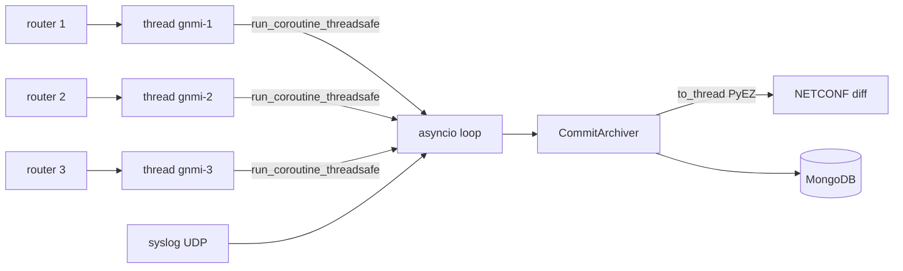

# Junos Commit Watcher

A small tool that turns Junos **commit** events into an archive of
configuration diffs stored in MongoDB — ready to be displayed later as a
per-router timeline of changes.

Commits can be detected two ways (`watcher.mode` in the config):

- **`syslog`** (default) — listen for `UI_COMMIT_COMPLETED` syslog messages.
- **`gnmi`** — open a gNMI **on-change** subscription to each router on
  `/junos/events/event[id=UI_COMMIT_PROGRESS]` and react to `commit complete`.
- **`both`** — run the syslog listener and the gNMI subscriptions together.

## How it works



1. The watcher detects a successful commit — either a syslog message
   containing `UI_COMMIT_COMPLETED`, or a gNMI `commit complete` event on
   `/junos/events/event[id=UI_COMMIT_PROGRESS]`.
2. It identifies the router (syslog hostname / packet source IP, or the
   configured gNMI router `name`/`hostname`).
3. It opens a **non-blocking** NETCONF session with
   [`juniper_api`](../README.md) and reads the diff of the latest commit
   (`show_diff(mode="committed")`) plus the device model and Junos version
   (`show version`). The blocking PyEZ work runs in a worker
   thread, so the listener never stalls while a device is queried.
4. It stores one document per commit:

   ```json
   {
     "source":  "core-router-1",
     "date":    "2026-07-06T12:34:56",
     "diff":    "[edit system]\n-  host-name OLD;\n+  host-name NEW;",
     "model":   "mx480",
     "version": "21.4R3-S4.9"
   }
   ```

   (plus `received_at` and `source_ip` for bookkeeping).

An index on `(source, date)` is created automatically so timeline queries such
as *"all changes to core-router-1, newest first"* are fast.

## Fast Run (config already done)

This is just the commands you have to issue in case all requierements was installed and all configuration was already done, otherwise see [First Time](#detailed-run-first-time)

```shell 
cd $PWD/juniper_api
docker compose -f tools/commit_watcher/docker-compose.yml up -d  

source .venv/bin/activate 
nohup python tools/commit_watcher/syslog_commit_watcher.py --config tools/commit_watcher/config.yaml > commit_watcher.log 2>&1 &
nohup python tools/commit_watcher/webapp.py --config tools/commit_watcher/config.yaml > webapp.log 2>&1 &
```

To stop everything: 

```
cd $PWD/juniper_api
docker compose -f tools/commit_watcher/docker-compose.yml down

ps aux | grep syslog_commit_watcher.py
kill <pid>

ps aux | grep webapp.py
kill <pid>
```

## Detailed Run (First time)

### 1. Configure the routers to send syslog

On each Juniper device, forward the change log to the host running the watcher.
Point it at the watcher's IP and the port from your config (default `5514`):

```
set system syslog host <WATCHER-IP> any warning
set system syslog host <WATCHER-IP> match .*UI_COMMIT_COMPLETED.*
```

#### Alternative: gNMI on-change (instead of, or alongside, syslog)

Set `watcher.mode: gnmi` (or `both`) and list the routers under `gnmi.routers`.
The watcher subscribes to `/junos/events/event[id=UI_COMMIT_PROGRESS]` and reacts
when a `commit complete` message is streamed, e.g.:

```
junos/events/event[facility=23][id=UI_COMMIT_PROGRESS][priority=190][type=2]/attributes[key=message]/value: commit complete
```

On the routers, enable the gRPC/gNMI service (extension-service), for example:

```
set system services extension-service request-response grpc clear-text port 32767
set system services extension-service notification allow-clients address 0.0.0.0/0
```

### 2. Start MongoDB as a container (data on a host volume)

The provided `docker-compose.yml` runs MongoDB and stores its data in
`./mongo-data` on the **host OS**, so nothing is lost when the container is
recreated.

```bash
cd $PWD/juniper_api

docker compose -f tools/commit_watcher/docker-compose.yml up -d          # starts MongoDB on 127.0.0.1:27017
docker compose ps             # verify it is running
```

The database files now live in `tools/mongo-data/` on the host. To use a
different location, edit the `volumes:` mapping in `docker-compose.yml`
(e.g. `- /srv/junos-commits/db:/data/db`).

To stop / remove the container (the data on the host volume is kept):

```bash
docker compose tools/commit_watcher/docker-compose.yml down
```

#### Inspect the stored data

```bash
docker exec -it junos-commits-mongo mongosh junos_commits
```

```javascript
// newest changes for one router (timeline order)
db.commit_diffs.find({ source: "core-router-1" }).sort({ date: -1 })

// everything, most recent first
db.commit_diffs.find().sort({ date: -1 }).limit(20)
```

The `(source, date)` index makes these per-router, time-ordered queries
efficient — the same shape you'll use to render a timeline UI later.

### 3. Set up the Python environment (venv)

From the **repository root**:

```bash
cd $PWD/juniper_api 
source .venv/bin/activate            # Windows: .venv\Scripts\activate

# Install the watcher's own dependencies
python -m pip install -r tools/commit_watcher/requirements.txt
```

### 4. Configure the watcher

```bash
cd tools/commit_watcher
cp config.example.yaml config.yaml
$EDITOR config.yaml                  # set device credentials, ports, MongoDB URI
```

Key sections in `config.yaml`:

- `watcher.mode` — detection back-end: `syslog` (default), `gnmi`, or `both`.
- `syslog` — bind address/port for the UDP listener.
- `gnmi` — gNMI port/credentials and the list of `routers` to subscribe to
  (used when `watcher.mode` is `gnmi` or `both`).
- `mongodb` — connection URI, database and collection names.
- `devices.defaults` — login used for every router (`user`, `passwd`,
  `ssh_private_key_file`, `port`, `timeout`, …). These are forwarded straight
  to `JuniperDevice`.

Every setting can also be provided via environment variables
(`WATCHER_MODE`, `SYSLOG_PORT`, `GNMI_PORT`, `MONGODB_URI`, …) — see the
comments in `config.example.yaml`.

> **Note on ports:** binding to the standard syslog port `514` requires root.

Sample Config:

```shell 
# Configuration for syslog_commit_watcher.py
#
# Copy this file to `config.yaml` and adjust the values.
# Every value can also be overridden with an environment variable
# (shown in [brackets] below).

syslog:
  host: 0.0.0.0        # [SYSLOG_HOST] interface to bind the UDP listener to
  port: 514           # [SYSLOG_PORT] UDP port to listen on (514 needs root)

mongodb:
  uri: mongodb://localhost:27017   # [MONGODB_URI]
  database: junos_commits          # [MONGODB_DB]
  collection: commit_diffs         # [MONGODB_COLLECTION]

# Web UI served by webapp.py.
web:
  host: 0.0.0.0        # [WEB_HOST] interface to bind the HTTP(S) server to
  port: 8080           # [WEB_PORT]
  ssl:
    enabled: true     # [WEB_SSL_ENABLED] serve over HTTPS when true
    certfile: /opt/juniper_api/tools/commit_watcher/certs/server.crt          # [WEB_SSL_CERTFILE] path to the TLS certificate (PEM)
    keyfile: /opt/juniper_api/tools/commit_watcher/certs/server.key           # [WEB_SSL_KEYFILE] path to the TLS private key (PEM)

devices:
  # Connect to the packet source IP by default. Set to true to instead
  # connect to the hostname reported in the syslog message.
  connect_by_hostname: false

  # Credentials/params applied to every device (forwarded to JuniperDevice).
  defaults:
    user: xxxxx
    passwd: xxxxx
    port: 830
    timeout: 30
```

### 5. Run the Watcher

```bash
python tools/commit_watcher/syslog_commit_watcher.py --config tools/commit_watcher/config.yaml
```

Add `-v` for debug logging. Use `-m/--mode` to override `watcher.mode` from the
command line (e.g. `--mode gnmi` or `--mode both`). You should see:

```
Listening for Junos commit syslogs on 0.0.0.0:514 -> MongoDB junos_commits/commit_diffs
```

or, in gNMI mode:

```
Subscribing to gNMI on-change (/junos/events/event[id=UI_COMMIT_PROGRESS]) for 1 router(s) -> MongoDB junos_commits/commit_diffs
```

Now commit any change on a router; a document appears in MongoDB:

```
Stored commit diff for core-router-1 (date=2026-07-06T12:34:56, id=...)
```

### 6. Run the Web UI

A small web front end ([`webapp.py`](webapp.py)) reads the same MongoDB
collection and lets you browse changes in the browser. It offers:

- **Changes** — every commit in a chosen time frame as clickable abstracts
  (router name, date, model, version); click one to reveal the full colour-coded
  diff.
- **Timeline** — a per-router timeline of changes; hover any point to see its
  date, model, version and diff.
- Light/dark theme (blue accent in light mode) with the choice remembered.

#### Run it

```bash
python tools/commit_watcher/webapp.py --config tools/commit_watcher/config.yaml
```

Then open <http://localhost:8080>. The UI shares the `config.yaml` `mongodb`
section with the watcher; the server itself is configured under the new `web`
section:

```yaml
web:
  host: 0.0.0.0
  port: 8080
  ssl:
    enabled: false     # set true to serve over HTTPS
    certfile: certs/server.crt
    keyfile:  certs/server.key
```

#### Enable HTTPS (SSL/TLS)

Set `web.ssl.enabled: true` and point `certfile`/`keyfile` at a certificate and
private key (PEM). For a quick self-signed cert for testing:

```bash
openssl req -x509 -newkey rsa:2048 -nodes -days 365 \
    -keyout watcher.key -out watcher.pem -subj "/CN=localhost"
```

With SSL enabled the UI is served on `https://<host>:<port>`. All web settings
also have environment overrides (`WEB_HOST`, `WEB_PORT`, `WEB_SSL_ENABLED`,
`WEB_SSL_CERTFILE`, `WEB_SSL_KEYFILE`).

> The web UI is read-only and exposes no credentials, but it does reveal your
> configuration diffs. Bind it to a management interface (or put it behind a
> reverse proxy / auth) rather than exposing it publicly.

## Troubleshooting

- **Nothing is stored:** confirm the router actually sends syslog to this host
  and port (`tcpdump -ni any udp port 5514`), and that the message contains
  `UI_COMMIT_COMPLETED`. Run the watcher with `-v`.
- **NETCONF errors:** verify credentials in `config.yaml` and that NETCONF over
  SSH is enabled on the device (`set system services netconf ssh`).
- **Empty diff stored:** the commit may not have changed the configuration
  (e.g. `commit` with no pending changes). The event is still recorded.
- **Web UI shows no data:** check the time range (top controls) and that the UI
  points at the same MongoDB database/collection as the watcher.