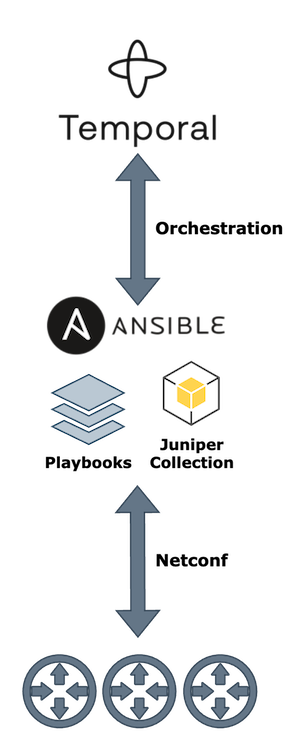
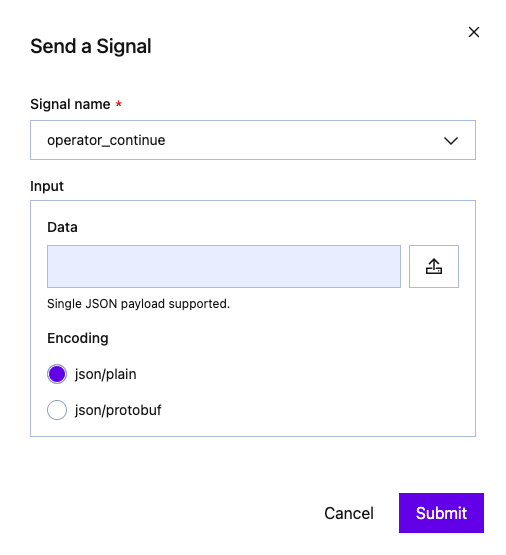
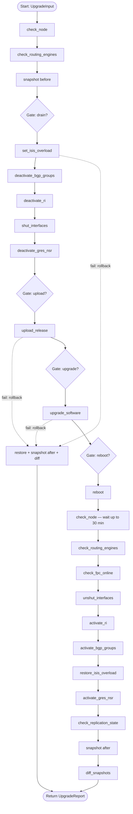

# Guided Junos upgrade — Temporal orchestrating Ansible playbooks

This tool reproduces a **"Junos Guided Upgrade"** workflow as a **Temporal.io** workflow —  each node runs
one of the Ansible playbooks bundled with this tool under [`ansible/playbooks/`](ansible/playbooks/) via `ansible-playbook`.

The **inventory** and **group-var** overrides are part of the Temporal JSON
input, so an operator can drive an entire run from the Web UI without editing
any file on the worker.



## How it works

- **Temporal server** — runs in Docker (PostgreSQL + Temporal + Web UI). It
  only stores workflow state; it does **not** run your code.
- **Worker** — a local Python process ([`upgrade-wf/ansible_upgrade_workflow.py`](upgrade-wf/ansible_upgrade_workflow.py))
  that executes the workflow and the single `run_playbook` activity. The
  activity shells out to `ansible-playbook`, running the bundled
  [`ansible/playbooks`](ansible/playbooks/) **in place** (so their `playbook_dir` /
  `state_dir` logic and `snapshot_commands.txt` keep working).
- **Inventory from JSON** — the activity writes a throw-away `inventory.yml`
  from `hosts` in the input and passes `user` / `password` / `release_file` /
  `group_vars` as **extra-vars** (highest Ansible precedence, so the JSON
  always wins). The device connection vars still come from
  [`ansible/group_vars/junos_devices.yml`](ansible/group_vars/junos_devices.yml).

## Install

From the repository root:

```bash
cd  $PWD/upgrade_temporal_ansible
python3- -m venv .venv
source .venv/bin/activate       

# Temporal SDK + ansible-core
python3 -m pip install -r requirements.txt

# Junos Ansible collection (PyEZ)
ansible-galaxy collection install -r ansible/requirements.yml
```

# Configuration 

Everything is done via the temporal.io UI you should pass as workflow input a JSON payload like this one: 

```json
{
  "target_hosts": "rtme-mx-25",
  "user": "CHANGE_ME",
  "password": "CHANGE_ME",
  "release_file": "junos-vmhost-install-mx-x86-64-24.2R2.18.tgz",
  "local_repo": "/opt/automation/upgrade_temporal_ansible/pkg",
  "re_target": "both",
  "hosts": {
    "rtme-mx-25": {
      "device_name": "rtme-mx-25.englab.juniper.net",
      "model": "mx480",
      "software": "junos"
    }
  },
  "group_vars": {},
  "extra_vars": {}
}
```

Note: you should place into the `pkg` folder:
- the Junos/EVO images, i.e, `junos-vmhost-install-mx-x86-64-24.2R2.18.tgz`
- a specific file, same name of the package suffixed with **.md5** extension: `junos-vmhost-install-mx-x86-64-24.2R2.18.tgz.md5` 

You could also edit the file `anssible/group_vars/junos_devices.yml` in case you want to change default behavior: 

```yaml
# --------------------------------------------------------------------------
# Defaults — override on the command line with --extra-vars / -e
# --------------------------------------------------------------------------

# Interfaces / BGP groups / routing-instances that must NEVER be touched.
interface_whitelist: ["lo0", "fxp0", "fxp1", "em0", "em1"]
bgp_group_whitelist: []
ri_whitelist: ["mgmt_junos"]

# ISIS overload options (all disabled by default).
overload_advertise_high_metrics: false
overload_allow_route_leaking: false
overload_external_prefixes: false
overload_internal_prefixes: false

# GRES / NSR knobs checked & deactivated by deactivate_gres_nsr.yml.
gres_nsr_knobs:
  - "routing-options nonstop-routing"
  - "protocols layer2-control nonstop-bridging"
  - "chassis redundancy graceful-switchover"
```

Note, you could pass specific (per router) config via the temporal json input if needed. 

## Run it

```bash
# 1. Start Temporal (Web UI entry port is always 8081)

# HTTP
docker compose -f temporal-stack/docker-compose.yml -f temporal-stack/docker-compose.http.yml up -d

# or HTTPS (generate a cert once: bash temporal_stack/certs/generate-certs.sh) 
# or use your own key/certificate (rename them in server.key and server.crt)
docker compose -f temporal-stack/docker-compose.yml -f temporal-stack/docker-compose.https.yml up -d

# 2. Start the worker

nohup python3 upgrade-wf/ansible_upgrade_workflow.py worker \
  > worker.log 2>&1 &
```

> The worker resolves the playbooks at `ansible`
> relative to this package. Override with the `UPGRADE_ANSIBLE_ROOT` env var or
> the `playbooks_root` input field if the layout differs on the worker host.

### Stopping

```bash
pkill -f ansible_upgrade_workflow.py

# HTTP 
docker compose -f temporal-stack/docker-compose.yml -f temporal-stack/docker-compose.http.yml down

# HTTPs
docker compose -f temporal-stack/docker-compose.yml -f temporal-stack/docker-compose.https.yml down
```

## Launching an upgrade

The workflow takes a single `UpgradeInput` (see [`upgrade-wf/upgrade_tasks/models.py`](upgrade-wf/upgrade_tasks/models.py)).

Connect to the GUI: `http(s)://<your-server>:8081

### From the Temporal Web UI (Start Workflow)

| Field | Value |
| --- | --- |
| **Workflow ID** | any unique id, e.g. `ansible-upgrade-rtme-mx-25` |
| **Task Queue** | `ansible-upgrade-queue` |
| **Workflow Type** | `AnsibleUpgradeWorkflow` |

Paste the input as a **single JSON object** — one argument. See [details](#input-fields). 

> Do **not** wrap it in an array (`[ ... ]`): the workflow's `run` takes a single `UpgradeInput`, so a wrapping array is decoded as a `list` and fails with `Cannot convert to dataclass UpgradeInput, value is <class 'list'> not dict`. 

See [`upgrade-wf/params.example.json`](upgrade-wf/params.example.json):

```json
{
  "target_hosts": "rtme-mx-25",
  "user": "CHANGE_ME",
  "password": "CHANGE_ME",
  "release_file": "junos-vmhost-install-mx-x86-64-24.2R2.18.tgz",
  "local_repo": "/opt/automation/upgrade_temporal_ansible/pkg",
  "re_target": "both",
  "hosts": {
    "rtme-mx-25": {
      "device_name": "rtme-mx-25.englab.juniper.net",
      "model": "mx480",
      "software": "junos"
    }
  },
  "group_vars": {},
  "extra_vars": {}
}
```

## Interact with the workflow. 

Sometimes the workflow will ask human validation, called "a gate (yellow task in the timeline)". In this case you should explicitly send a "signal" to indicate you want to continue (max timeout is 30mins). 

To send a signal:

- Open workflow with the GUI
- Click on the right corner "More Actions" 
- Select "Send a signal" option 
- Select "operator_continue" signal and then "Submit"



### From the CLI

```bash
python3 upgrade-wf/ansible_upgrade_workflow.py start upgrade-wf/params.example.json
```

### Input fields

Here are the main fields of the temporal JSON input:

| Field | Required | Default | Description |
| --- | --- | --- | --- |
| `target_hosts` | ✅ | — | Ansible `--limit`: a host or group from `hosts`. |
| `user` | ✅ | — | Device login username (→ `ansible_user`). |
| `password` | ✅* | `null` | Device login password (→ `ansible_password`). |
| `release_file` | ✅ | — | Image filename present in `local_repo` (with its `.md5`). |
| `local_repo` | | `/var/tmp/images` | Controller folder holding the image + `.md5`. |
| `re_target` | | `both` | Junos install target: `both` / `re0` / `re1`. |
| `hosts` | ✅ | `{}` | Inventory: `name → {device_name, model, software}`. |
| `group_vars` | | `{}` | `junos_devices` group-var overrides (overload flags, whitelists). |
| `extra_vars` | | `{}` | Extra vars applied to every playbook. |
| `approval_timeout_minutes` | | `30` | How long each gate waits before timing out. |
| `playbooks_root` | | auto | Path to the Ansible root (containing playbooks/) on the worker. |

## Variables reference

Two layers of variables drive the playbooks:

- **`group_vars`** — defaults defined in
  [`ansible/group_vars/junos_devices.yml`](ansible/group_vars/junos_devices.yml).
  Override per run by putting them under `group_vars` (or `extra_vars`) in the
  JSON input, or with `-e` when running a playbook directly.
- **`extra_vars`** — per-playbook tunables. Put them under `extra_vars` in the
  JSON input (applied to **every** playbook, highest precedence) or pass with
  `-e` on the CLI.

### group_vars (`ansible/group_vars/junos_devices.yml`)

Connection (usually leave as-is; sourced from the JSON input):

| Variable | Default | Description |
| --- | --- | --- |
| `ansible_connection` | `juniper.device.pyez` | PyEZ/NETCONF connection plugin. |
| `ansible_host` | `{{ device_name }}` | Target address; the per-host FQDN. |
| `ansible_user` | `{{ user }}` | Login user, from the `user` input. |
| `ansible_password` | `{{ password }}` | Login password, from the `password` input. |
| `ansible_port` | `830` | NETCONF-over-SSH port. |
| `ansible_python_interpreter` | `{{ ansible_playbook_python }}` | Python used on the controller. |
| `state_dir` | `<repo>/state` | Root of per-device state/snapshot files. |

Behaviour defaults (safe to override):

| Variable | Default | Used by | Description |
| --- | --- | --- | --- |
| `interface_whitelist` | `[]` | shut/unshut_interfaces | Interfaces that must NEVER be shut. |
| `bgp_group_whitelist` | `[]` | de/activate_bgp_groups | BGP groups never deactivated. |
| `ri_whitelist` | `[]` | de/activate_ri | Routing-instances never deactivated. |
| `overload_advertise_high_metrics` | `false` | set_isis_overload | Add `advertise-high-metrics`. |
| `overload_allow_route_leaking` | `false` | set_isis_overload | Add `allow-route-leaking`. |
| `overload_external_prefixes` | `false` | set_isis_overload | Add `external-prefixes`. |
| `overload_internal_prefixes` | `false` | set_isis_overload | Add `internal-prefixes`. |
| `gres_nsr_knobs` | list (GRES/NSR/NSB) | de/activate_gres_nsr | Config knobs deactivated during drain. |

Per-host vars (set inside `hosts.<name>` in the JSON input):

| Variable | Required | Description |
| --- | --- | --- |
| `device_name` | ✅ | Device FQDN (used for `ansible_host` and state paths). |
| `model` | | Informational (e.g. `mx480`, `ptx10008`). |
| `software` | | `junos` or `evo` — drives EVO-specific behaviour. |

### extra_vars (per-playbook overrides)

| Variable | Default | Playbook(s) | Description |
| --- | --- | --- | --- |
| `release_file` | — (required) | upload_release, upgrade_software | Image filename in `local_repo` / `/var/tmp`. |
| `local_repo` | `/var/tmp/images` | upload_release | Controller folder holding image + `.md5`. |
| `remote_dir` | `/var/tmp` | upload_release, upgrade_software | Image directory on the device. |
| `md5_file` | `<release_file>.md5` | upload_release | Checksum filename in `local_repo`. |
| `re_target` | `both` | upgrade_software | Junos install target: `both` / `re0` / `re1`. |
| `validate_config` | `false` | upgrade_software | Run `validate` against the new image. |
| `install_timeout` | `1800` | upgrade_software | Install RPC timeout (seconds). |
| `force_install` | `false` | upgrade_software | Bypass the "already at target version" check (passes `version:false`). |
| `target_version` | auto (from filename) | upgrade_software | Explicit version the module compares against. |
| `re_target` (reboot) | `both` | reboot | Reboot target: `both` / `local` / `other`. |
| `vmhost` | auto (from filename) | reboot | `request vmhost reboot`; defaults to true when `release_file` contains `vmhost`. |
| `in_min` | unset | reboot | Reboot in N minutes. |
| `at` | unset | reboot | Reboot at `hh:mm` or `yyyymmddhhmm`. |
| `snapshot_label` | — (required) | snapshot | Label for the capture (`before` / `after`). |
| `commands_file` | `playbooks/snapshot_commands.txt` | snapshot, diff_snapshots | Command list to capture/compare. |
| `before_label` | `before` | diff_snapshots | First snapshot label to compare. |
| `after_label` | `after` | diff_snapshots | Second snapshot label to compare. |
| `diff_fail_on_change` | `true` | diff_snapshots | Fail on any diff (workflow sets `false`). |
| `diff_ignore_patterns` | volatile-field regexes | diff_snapshots | Lines ignored via `diff --ignore-matching-lines`. |
| `probe_interval` | `5` | check_node | Seconds between NETCONF reachability probes. |
| `probe_timeout` | `1800` | check_node | Max seconds to wait for reachability. |
| `poll_interval` | `30` | check_routing_engines, check_replication_state | Seconds between polls. |
| `poll_timeout` | `1800` | check_routing_engines, check_replication_state | Max seconds to wait. |
| `poll_interval` (fpc) | `10` | check_fpc_online | Seconds between FPC-online polls. |
| `poll_timeout` (fpc) | `600` | check_fpc_online | Max seconds to wait for all present FPCs to reach `Online` (they can sit in `Present` for minutes after a reboot). |

> Whitelists (`interface_whitelist`, `bgp_group_whitelist`, `ri_whitelist`),
> ISIS `overload_*` flags and `gres_nsr_knobs` are group_vars but are commonly
> passed per run via the input's `group_vars` (or `extra_vars`) map.

## Continue gates

The AWX `workflow_approval` nodes become **continue gates**. At each gate the
workflow pauses until you send the empty `operator_continue` signal:

- **Temporal Web UI** → open the running workflow → **Signals** → send
  `operator_continue` (no input).
- **CLI**:

  ```bash
  python3 tools/upgrade_temporal_ansible/upgrade-wf/ansible_upgrade_workflow.py \
    continue ansible-upgrade-rtme-mx-25
  ```

Query `current_step` to see which gate is active.

## Snapshot diffing

`snapshot.yml` captures `snapshot_commands.txt` output `before` the drain and
`after` the restore; `diff_snapshots.yml` compares the two. Two things make the
diff robust to a real upgrade/reboot:

- **Volatile fields are ignored.** Session up/down timers, absolute
  timestamps, high-water marks and uptimes are stripped before comparing
  (`diff --ignore-matching-lines`). Override the list via the
  `diff_ignore_patterns` extra-var.
- **Diffs are informational by default in the workflow.** Because volatile
  counters legitimately change across a reboot, the workflow runs the diff with
  `diff_fail_on_change: false`, so a diff is logged in the report but does not
  fail an already-successful upgrade (or its rollback). Set
  `diff_fail_on_change: true` (via `extra_vars`) to make any difference fatal.

## Detailed WorkFlow

Diamond nodes are human continue gates; dashed arrows are compensation
(rollback) paths. Each box is one `ansible-playbook` run.


